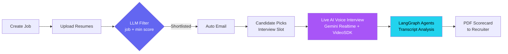
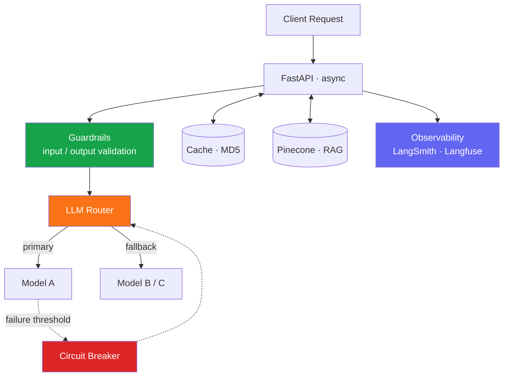

<div align="center">


<br/>

<a href="https://harsh-shrivastava-portfolio.netlify.app/"></a>
<a href="https://www.linkedin.com/in/harsh-shrivastava-dev/"></a>
<a href="mailto:hshrivastava559@gmail.com"></a>


</div>

---

## `>_ whoami`

```python
class HarshShrivastava:
    role        = "AI Engineer"
    location    = "Noida, India 🇮🇳"
    focus       = ["Agentic AI", "Voice AI Agents", "RAG", "LLM Ops"]
    building    = ["Hanrry AI  →  autonomous voice-driven hiring pipeline",
                   "NogenAI    →  AI-first education platform (50+ users)"]
    reliability = ["guardrails", "LLM router", "circuit breaker", "observability"]
    stack       = ["Python", "FastAPI", "LangGraph", "Pinecone", "Docker", "AWS"]
    exploring   = ["LLM evals", "agent reliability", "voice-agent latency"]
    philosophy  = "Demos impress. Production survives."

    def open_to(self):
        return "AI Engineer / GenAI / Agentic AI roles 🚀"
```

---

## ⚡ Tech Arsenal

<div align="center">

**🧠 AI / LLM Engineering**


**📡 LLMOps & Reliability**


**🛠️ Engineering Stack**


</div>

---

## 🚀 Featured Projects

### 🎙️ Hanrry AI — Autonomous, Voice-AI-Driven Recruitment Pipeline

An end-to-end agentic hiring workflow — from job creation to a recruiter-ready evaluation report.



- 🎧 Real-time, low-latency voice interviewer with dynamic, JD-specific questions
- 🧩 **LangGraph** multi-agent workflow for transcript analysis and candidate scorecards
- ⏱️ Async **FastAPI** backend + **APScheduler** for scheduling, notifications and orchestration

`Python` `FastAPI` `LangGraph` `Gemini Realtime API` `VideoSDK` `APScheduler` `SQLAlchemy`

<br/>

### 🎓 NogenAI — AI-First Education Platform

🌐 **[nogenai.in](https://nogenai.in)** &nbsp;·&nbsp; 👥 **50+ active users** &nbsp;·&nbsp; ☁️ deployed end-to-end on AWS

- 📚 RAG pipelines + Pinecone for personalised tutoring and intelligent content retrieval
- 📄 Document ingestion for PDF/DOCX (PyMuPDF4LLM, PyPDF2, Textract)
- 🚢 **S3 + CloudFront** (frontend) · **EC2 + Nginx + PM2** (backend)

`RAG` `Pinecone` `FastAPI` `Node.js` `React` `AWS`

<br/>

### 🧰 More Projects

| Project | What it does | Stack |
|:--|:--|:--|
| 📰 [**News AI Agent**](https://github.com/HARSHSHRI12/News_Ai_Agent-Crewai-) | Researcher + Writer agents turn live web research into structured articles | `CrewAI` `Gemini 2.5 Flash` `Serper` |
| 🔗 [**LangChain AI Toolkit**](https://github.com/HARSHSHRI12/Langchain-Pinecone-DynamicPrompting-ChatHistory-LangSmith-monitoring) | RAG chatbot with chat history, dynamic prompts, vector search & tracing | `LangChain` `Pinecone` `LangSmith` |
| 🗓️ [**Routine-AI**](https://github.com/HARSHSHRI12/Routine-AI) | NLP timetable manager: free-text → structured schedules + email reminders | `React` `Node.js` `FastAPI` `MongoDB` |
| 🧭 **Career Advisor System** | RAG + LLM personalised career-path recommendations | `FastAPI` `React` `RAG` |

---

## 🧠 How I Engineer LLM Systems



> **Principle:** every LLM call is treated as an unreliable network dependency — validated, routed, cached, traced, and given a fallback.

---

## 📊 GitHub Analytics

<div align="center">


</div>

---

## 🤝 Let's Build Something

Open to **AI Engineer · GenAI · Agentic AI** roles — teams where reliability and shipping matter as much as the demo.

<div align="center">

<a href="https://www.linkedin.com/in/harsh-shrivastava-dev/"></a>
<a href="https://harsh-shrivastava-portfolio.netlify.app/"></a>
<a href="mailto:hshrivastava559@gmail.com"></a>

<br/><br/>


</div>
